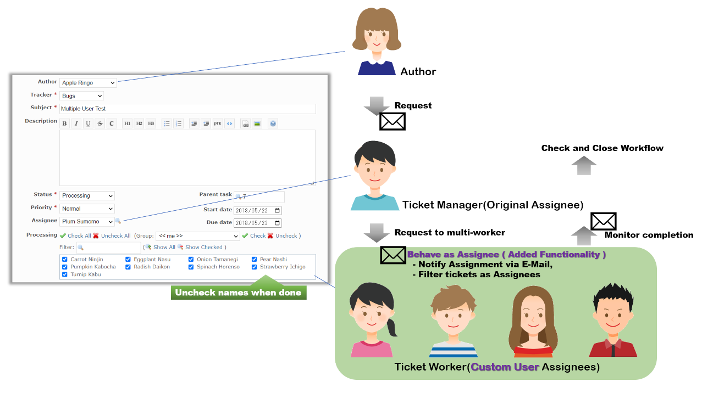

# Expand Custom Users as Assignees plugin for Multiple Assignees

Redmine plugin for adding assignee functionality includes default query and reminder to **Custom Users**.  
*) **Custom Users** means the users specified in the **Custom field** of the **User** format AND check box named "Use as assignee" is checked.

This plugin can realize multiple assignees on issues for review tasks by multiple people use case and so on.
  * send email notifications to **Custom Users who are added or removed** on issues, or all **Custom Users** as broadcast when **Custom Users** are not changed on issues, as well as authors and assignees.
  * send reminder to users set in **Custom Users** on issues
  * issues that **Custom Users** are listed on are queried as assignees such as **"My page" > "Issues assigned to me"**  
    *) Use "just Assignee" field instead to proceed query by the original scope of "assignee".

## Use Case Image
  
The recommended operation is keeping a ticket manager in the original Assignee separated from Custom Users assignment.

## Installation

1. To install the plugin

    `git clone` to `plugins/custom_users_as_assignees` on your Redmine path (or take at tag file, it's better)

        $ cd {RAILS_ROOT}/plugins
        $ bundle exec rake  redmine:plugins:migrate  RAILS_ENV=production NAME=custom_users_as_assignees
        $ git clone https://github.com/preciousplum/custom_users_as_assignees

2. Restart Redmine.

    Now you should be able to see the plugin in **Administration > Plugins**.
## Utilization 
* Create a custom Field with a Type *user*
* 

## Compatibility
This plugin has been tested on Redmine 5.0.x.

## Special Thanks
This plugin was initially developed by preciousplum
